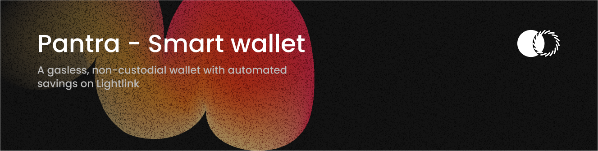
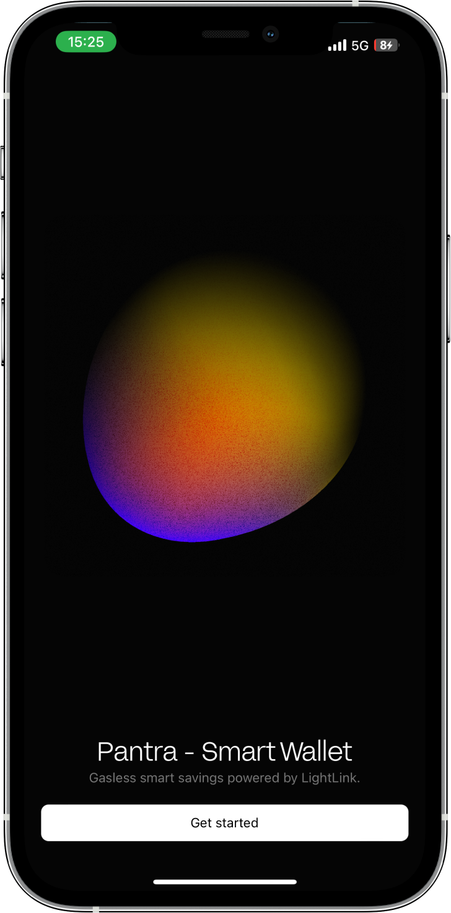
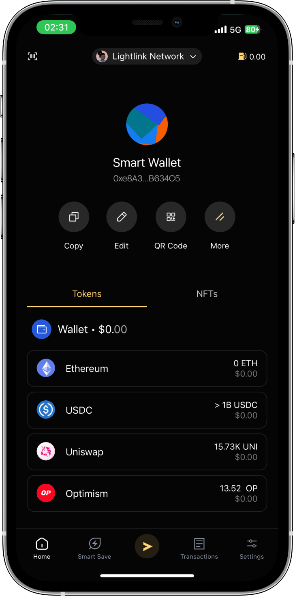
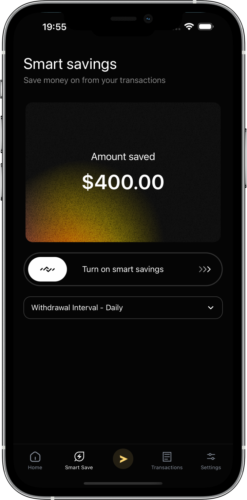
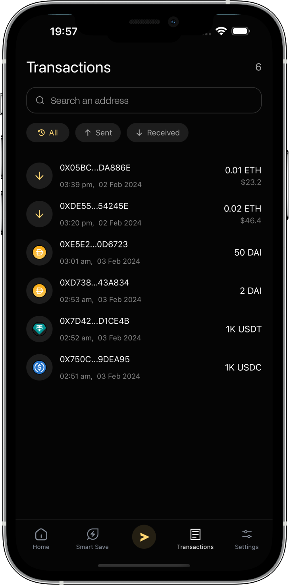
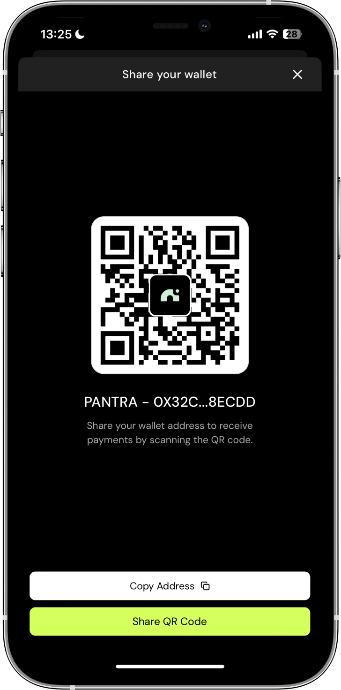
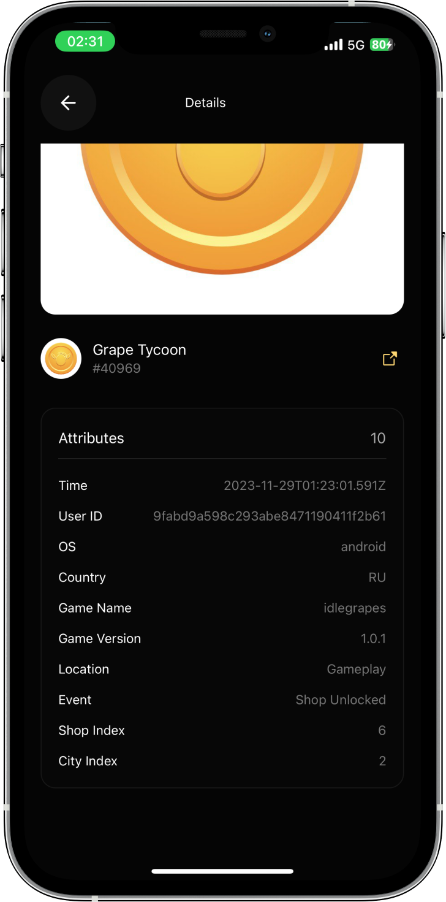
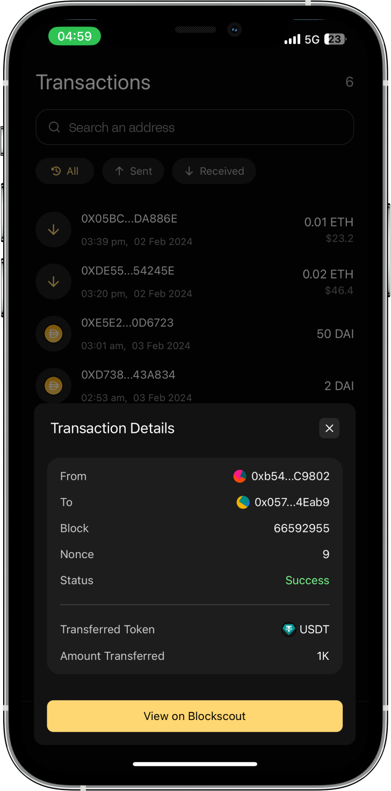

<a href="https://pantra.framer.website">
  <picture>
    
  </picture>
</a>

<br />

<div>
  
</div>

### Features

Pantra is a gasless, non-custodial wallet with automated savings built on Lightlink Network. Features include:

- Automatically rounds up your transactions and deposits the spare change into an interest-earning savings wallet.
- Generate weekly NFT tokens that visualize and track your accumulated savings.
- Gasless transactions mean 100% of your funds go towards purchases instead of network fees.
- As a non-custodial wallet, only you control your private keys and crypto assets.
- Beautiful and intuitive interface for managing your portfolio balances, dApps, savings, and transaction history.

### Project links

- [Mobile app](https://github.com/codergon/Pantra-app)
- [Contracts](https://github.com/Tee-py/pantra-contracts)

### Try it!

Download the mobile-app repository and run the following commands:

### iOS

```sh
yarn setup
```

### Android

```sh
yarn setup:android
```

### Screenshots

<table>
  <tr>
    <td width="33%" style='border: none'>
      
    </td>
    <td width="33%" style='border: none'>
      
    </td>
    <td width="33%" style='border: none'>
      
    </td>
  </tr>
</table>

<table>
  <tr>
    <td width="33%" style='border: none'>
      
    </td>
    <td width="33%" style='border: none'>
      
    </td>
    <td width="33%" style='border: none'>
      
    </td>
  </tr>
</table>

## Project built by

- [**@devteepy**](https://twitter.com/devteepy)
- [**@thealpha_knight**](https://twitter.com/thealpha_knight)
